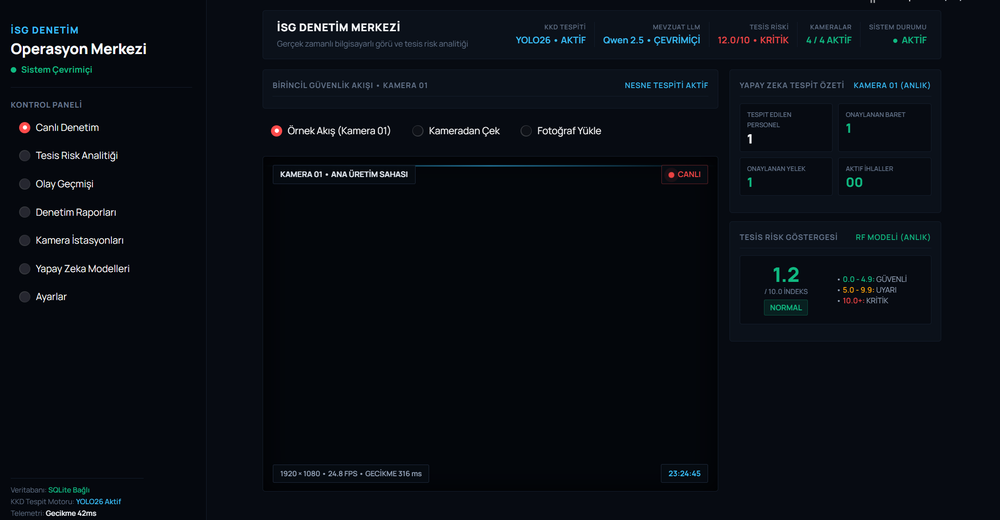
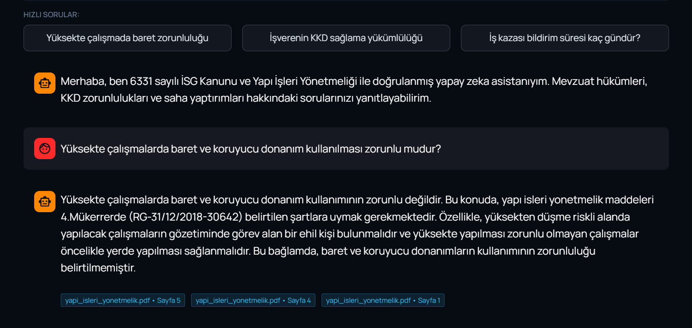
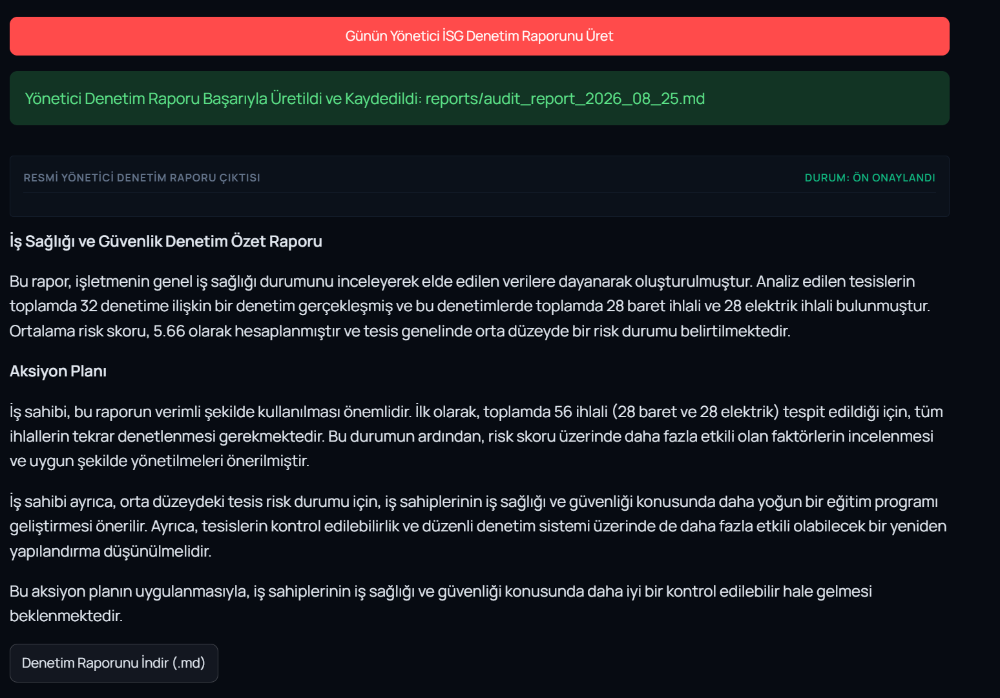

# İSG DENETİM MERKEZİ • Yapay Zeka Destekli Tesis ve Güvenlik Platformu

Endüstriyel tesislerde iş sağlığı ve güvenliği standartlarını (KKD uyumu, risk analitiği, mevzuat danışmanlığı ve yönetici raporlaması) gerçek zamanlı yapay zeka ile denetleyen yeni nesil operasyon ve izleme merkezi.

---

##  Ekran Görüntüleri (Arayüz & Çıktılar)

### 1. Canlı Denetim ve Operasyon Merkezi
YOLO modeli ile canlı KKD (baret/yelek) tespiti, telemetri göstergeleri ve anlık risk kadranı.


### 2. İSG Mevzuat Asistanı (RAG & Qwen 2.5)
6331 sayılı İSG Kanunu ve Yapı İşleri Yönetmeliği ile doğrulanmış yerel yapay zeka asistanı.


### 3. Otomatik Yönetici Denetim Raporu
SQLite veritabanı kayıtlarını analiz ederek tek tıkla üretilen resmi yönetici özeti ve DÖF aksiyon planı.


---

##  Temel Modüller ve Mimari

1. **Görsel KKD Tespit Motoru (Computer Vision):**
   - **Model:** Fine-tuned YOLO26s (`models/yolo_ppe_best.pt`)
   - **Sınıflar:** Baret (`helmet`), Yelek (`vest`), Baretsiz (`no-helmet`), Yeleksiz (`no-vest`)
   - **Başarım:** %94.2 mAP@50 doğruluk oranı

2. **Tesis Risk Analitiği (Machine Learning):**
   - **Model:** Random Forest Classifier (`models/risk_classifier_v2.pkl`)
   - **Çıktı:** Tehlike Skoru (0-10) ve Risk Seviyesi (*Normal / Uyarı / Kritik*)

3. **İSG Denetim Veritabanı (Database & Telemetry):**
   - **Altyapı:** SQLite (`database/isg_audit.db`)
   - **Özellik:** Canlı çekilen fotoğrafların ve ihlallerin anlık otomatik kaydı

4. **RAG Tabanlı İSG Mevzuat Asistanı (Generative AI & RAG):**
   - **LLM & Vektör:** Ollama Qwen 2.5 (3B) + FAISS Vektör İndeksi
   - **Kaynak:** 6331 Sayılı İSG Kanunu ve Yapı İşleri Yönetmeliği

5. **Otomatik Yönetici Raporlayıcı:**
   - Fabrika yönetimi için periyodik denetim özeti ve Markdown formatında indirilebilir rapor üretir.

---

##  Kurulum ve Çalıştırma

### Gereksinimler
- Python 3.12+
- Ollama (`ollama pull qwen2.5:3b`)

```bash
# 1. Bağımlılıkları yükleyin
pip install -r requirements.txt

# 2. Web Kokpitini Başlatın
streamlit run app.py

# 3. Birim Testleri Çalıştırın
python -m unittest discover tests
```

---

##  Dizin Yapısı

```text
staj/
├── app.py                          # Streamlit HUD Dashboard (Ana Arayüz)
├── core/                           # Risk & Model Eğitim Modülleri
├── database/                       # SQLite Veritabanı ve Yöneticisi
├── genai/                          # RAG, LLM Asistanı ve Rapor Üreticisi
├── models/                         # YOLO ve Random Forest Ağırlıkları
├── reports/                        # Üretilen Yönetici Raporları (.md)
├── screenshots/                    # Ekran Görüntüleri (arayuz, asistan, rapor)
├── tests/                          # Otomatik Birim Testler
├── vectorstore/                    # FAISS Vektör İndeks Dosyaları
├── requirements.txt                # Gerekli Kütüphaneler
└── README.md                       # Proje Dokümantasyonu
```
